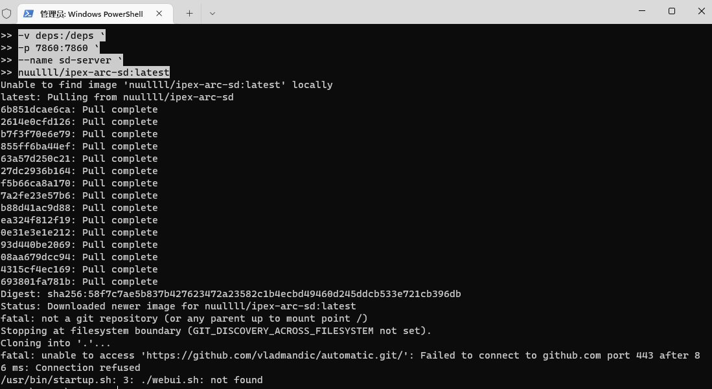
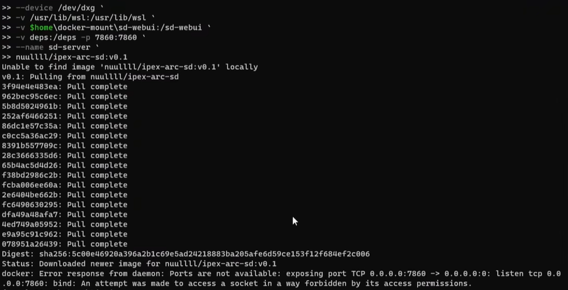
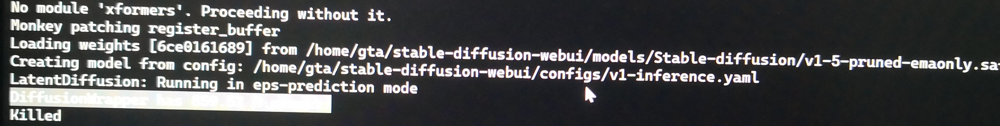
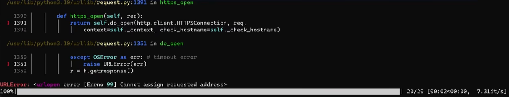

# 常见问题

## 环境设置

### 从Github下载代码的网络问题



> 网络问题对中国用户很常见。。。
>
> 请在你的宿主机上设置一个稳定的代理，启用[TUN模式](https://docs.cfw.lbyczf.com/contents/tun.html)（可能还需要配合`系统代理`食用）再重试。
>
> 或者你可以在执行`docker run`的时候指定环境变量：
> 
> ```powershell
> docker run -it `
> --device /dev/dxg `
> -v /usr/lib/wsl:/usr/lib/wsl `
> -v $home\docker-mount\sd-webui:/sd-webui `
> -v deps:/deps `
> -p 7860:7860 `
> --rm `
> -e http_proxy=<host_ip>:<proxy_port> `
> -e https_proxy=<host_ip>:<proxy_port> `
> nuullll/ipex-arc-sd:latest
> ```
> 
> 比如，`-e http_proxy=http://192.168.1.2:7890`。在WSL2里`localhost`或者`127.0.0.1`可能不起作用，请把`<host_ip>`替换为你宿主机的真实IP。

### 安装python包的网络问题

> 网络问题对中国用户很常见。。。你可以尝试[上面](#从github下载代码的网络问题)的办法。
>
> 或者通过环境变量`PIP_EXTRA_INDEX_URL`给pip指定一个国内的镜像源（例如清华的TUNA）：
>
> ```powershell
> docker run -it `
> --device /dev/dxg `
> -v /usr/lib/wsl:/usr/lib/wsl `
> -v $home\docker-mount\sd-webui:/sd-webui `
> -v deps:/deps `
> -p 7860:7860 `
> --rm `
> -e PIP_EXTRA_INDEX_URL=https://pypi.tuna.tsinghua.edu.cn/simple `
> nuullll/ipex-arc-sd:latest
> ```

### docker run: Ports are not available （端口不可用）



完整错误信息：

```txt
docker: Error response from daemon: Ports are not available: exposing port TCP 0.0.0.0:7860 -> 0.0.0.0: listen tcp 0.0.0.0:7860: bind: An attempt was made to access a socket in a way forbidden by its access permissions.
```

> 我在windows特定的网络配置下遇到过这个问题。
>
> 解决方案（[指引](https://github.com/docker/for-win/issues/9272#issuecomment-776225866)）：
> 1. 以**管理员**身份打开cmd/powershell。
> 2. 执行`net stop winnat`。
> 3. [重启容器](getting-started.md#重启容器)。
> 4. 容器运行起来后，执行`net start winnat`。

### Killed （强制终止）没有其他提示



> 通常是用于分配给WSL的内存不足导致的。Web UI最少需要7GB内存（估算的）才能运行基本功能。
>
> 默认情况下，宿主机的50%内存会分配给WSL。你可以[在容器中执行`free -m`](getting-started.md#在正在运行的容器中新开一个终端)确认一下。
>
> 解决方案（[指引](https://learn.microsoft.com/en-us/answers/questions/1296124/how-to-increase-memory-and-cpu-limits-for-wsl2-win)）：
> 1. 在宿主机用户目录下创建一个名为`.wslconfig`的文本文件。
> 2. 编辑`.wslconfig`并保存为如下内容（以16GB为例）：
> 
> ```.wslconfig
> # Settings apply across all Linux distros running on WSL 2
> [wsl2]
> 
> # Limits VM memory to use no more than 16 GB, this can be set as whole numbers using GB or MB
> memory=16GB
> ```

## Web UI运行中

### 容器卡死

> 你可能无法以正常的方式[终止容器](getting-started.md#终止容器)。
>
> 尝试右键点击系统托盘的Docker Desktop图标并点击`restart（重启）`。不行的话，重启电脑吧。:cold_sweat:

### URLError: [Errno 99] Cannot assign requested address（无法赋予请求的地址）



> 可能会在跑图的时候发生，原因是前端发送了太多查询生成图片进度的请求，但这个问题并不影响图片的生成。
>
> 解决方案：
>
> 编辑`<host_mount_dir>\javascript\progressBar.js`：把函数`requestProgress()`的参数`once`默认值改为`true`。

### 生成图片时Aborted（被终止）

完整错误信息：

```txt
Abort was called at 718 line in file:
../../neo/shared/source/os_interface/windows/wddm_memory_manager.cpp
```

> 解决方案：在设备管理器或者BIOS中禁用核显。见[#1272](https://github.com/vladmandic/automatic/issues/1272)。

### 跑图若干次后DPCPP out of memory （内存耗尽）

完整错误信息：

```txt
DPCPP out of memory. Tried to allocate 186.00 MiB (GPU Time taken: 22.18s | GPU active 3754 MB reserved 3888 MB | System peak 3754 MB total 13005 MB
```

> 见[#8](https://github.com/Nuullll/ipex-sd-docker-for-arc-gpu/issues/8)。我复现了这个问题，但可惜原因不明。看起来像是内存泄漏问题。
>
> 解决方案：重启Web UI服务。

